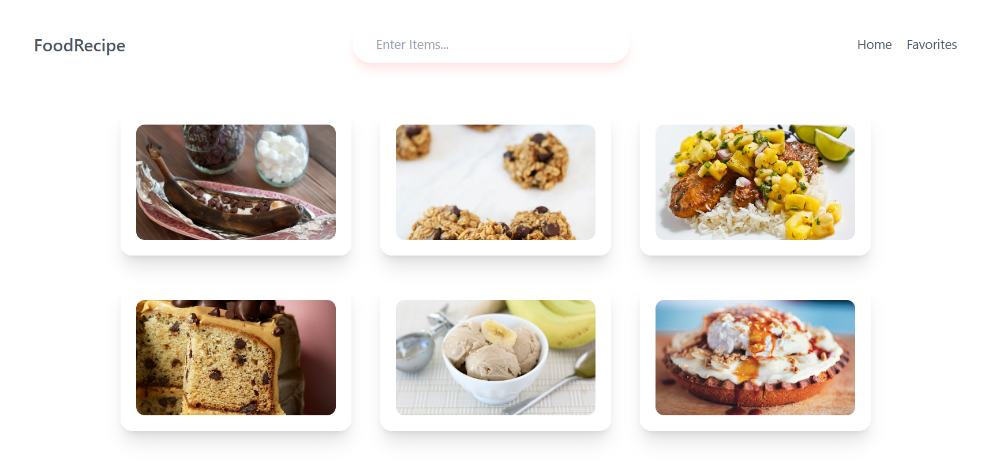
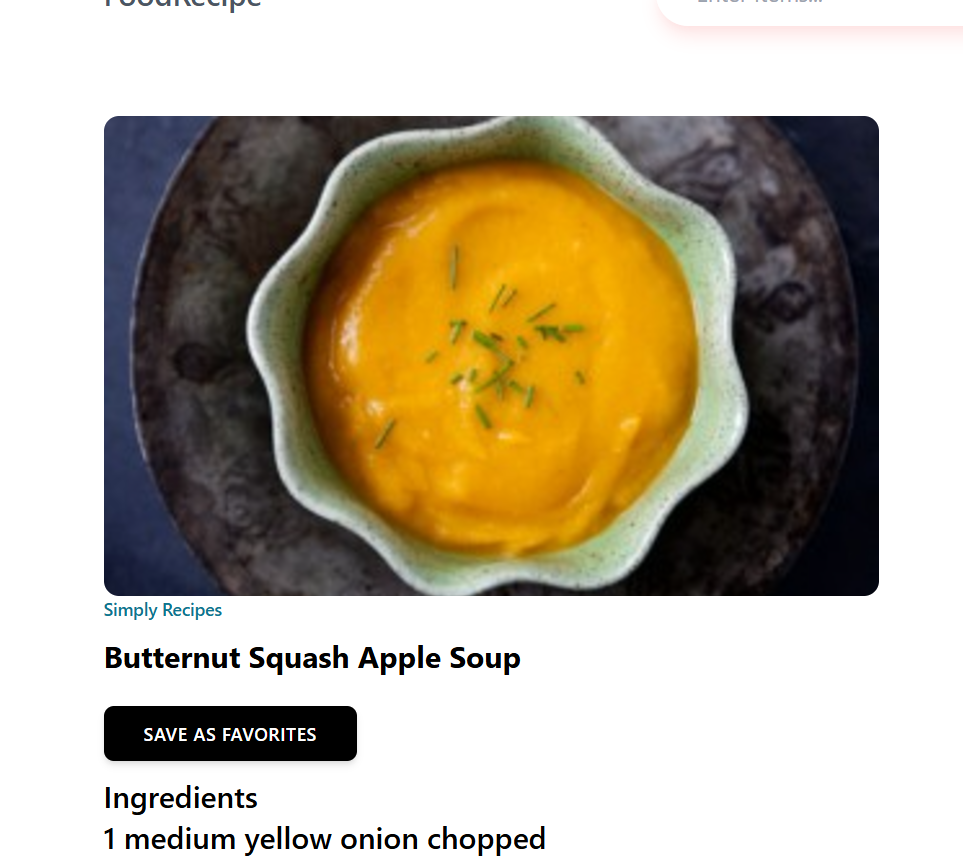

# Food recipe

# use GlobalContext
in the home page for example
bring recipeList and loading from 
Global context
const {recipeList,Loading}= useContext(GlobalContext)

home page return

if it in loading state
it returns loading....

recipeItem with the prop of item
recipeList.map(item=><RecipeItem item={item}/>)
      : 

       
Please search another
 
        

# receipe details

get the id from the home page when we click based on that
fetch the data and map the ingridient  and image

const {id} = useParams()
  const {recipeDetailsData,setRecipeDetailsData}=useContext(GlobalContext)

  useEffect(()=>{
    async function getRecipeDetails() {
      const response = await fetch(`https://forkify-api.herokuapp.com/api/v2/recipes/${id}`)
      const  data        = await response.json()
      if(data?.data){
        setRecipeDetailsData(data?.data)
      }
    }
    getRecipeDetails()
  },[])

  <ul >
    {
    recipeDetailsData?.recipe?.ingredients.map(ingredient=>
      <li>
        {ingredient.quantity} {ingredient.unit}
        {ingredient.description}
      </li>
    )
  }
</ul>

